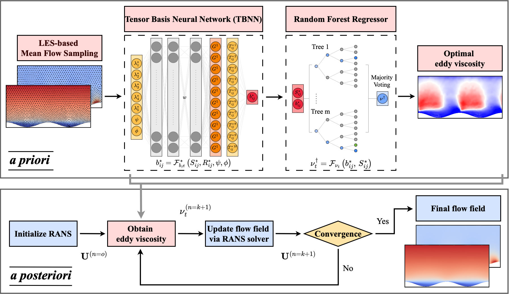

# Tensor-Basis-Neural-Network

This repository presents a hybrid turbulence modeling framework that integrates a **Tensor Basis Neural Network (TBNN)** with a regression model to improve eddy viscosity prediction in Reynolds-Averaged Navier–Stokes (RANS) simulations. The framework is validated on three canonical separated flows: **wavy bottom**, **curved step**, and **rectangular step** channel flows.

## Overview

The modeling strategy consists of two stages:

1. **A priori stage**: A TBNN is trained to reconstruct anisotropic Reynolds stresses from LES-based input features. The predicted stress tensor is then passed to a regression model (e.g., Random Forest) to derive an optimal eddy viscosity field.
2. **A posteriori stage**: The learned eddy viscosity is integrated into a RANS solver to iteratively update the flow field until convergence.

The overall structure is illustrated below:

<p align="center">
  
</p>

*Figure: Hybrid framework incorporating TBNN and regression-based eddy viscosity correction.*

## Repository Structure

| Folder              | Description                                                                 |
|---------------------|-----------------------------------------------------------------------------|
| `Data/`             | Contains LES-based input features and output labels for all geometries.    |
| `Data_engineering/` | Includes preprocessing routines for generating invariants, basis tensors, and normalization. |
| `Model/`            | Includes model definitions and training routines for both TBNN and the regression model. |

Each folder contains data and scripts for the following geometries:
- Wavy bottom channel
- Curved step channel
- Rectangular step channel

## Methodology

### Tensor Basis Neural Network (TBNN)

- **Input**: Scalar invariants \( \lambda_1 \sim \lambda_5 \), streamfunction \( \psi \), and velocity potential \( \phi \)
- **Output**: Anisotropic Reynolds stress \( b^*_{ij} \), expressed as a weighted sum of tensor bases:
  \[
  b^*_{ij} = \mathcal{F}^*_{be}(S^*_{ij}, R^*_{ij}, \psi, \phi)
  \]

### Regression Model

- **Input**: TBNN-predicted \( b^*_{ij} \) and normalized strain rate tensor \( S^*_{ij} \)
- **Output**: Optimal eddy viscosity \( \nu_t^\dagger \), computed via regression:
  \[
  \nu_t^\dagger = \mathcal{F}_\nu(b^*_{ij}, S^*_{ij})
  \]

### A Posteriori Embedding

The predicted viscosity is iteratively updated in the RANS solver:

1. Initialize RANS with zero eddy viscosity.
2. At each iteration:
   - Evaluate features from the flow field.
   - Predict \( \nu_t^\dagger \) via TBNN + regression.
   - Update the flow field.
3. Repeat until convergence.

## How to Use

1. Install dependencies
   ```bash
   pip install -r requirements.txt